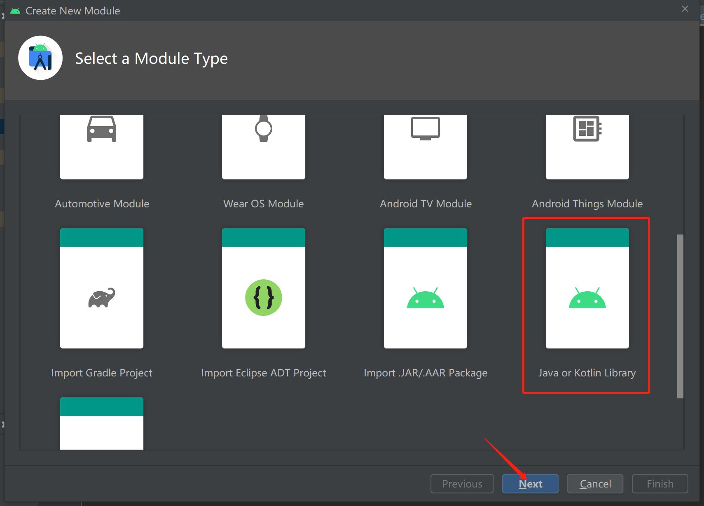
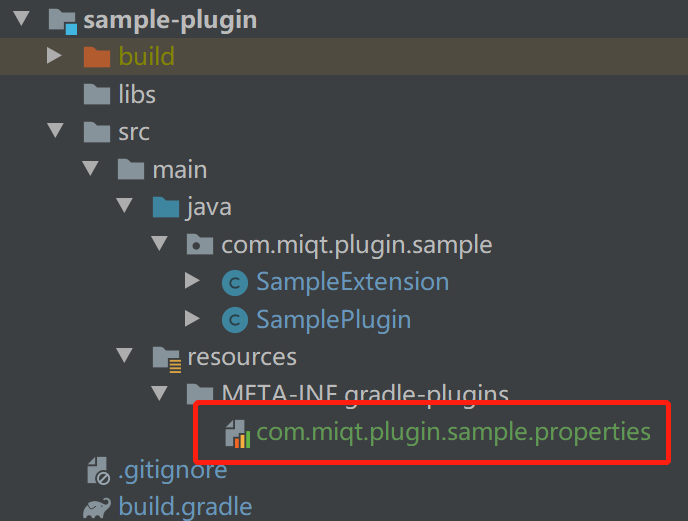

Android 字节码插件集合，base_plugin 封装好了增量编译等编写插件重复代码，这样后续开发只需要关注对字节码的操作

可以认为是ByteX的简单版本。

目前已经开发两个插件：
1. [hook-method](/plugin/hook-method/readme.md)
1. [sample-plugin](/plugin/sample-plugin/readme.md)

基于base-plugin开发新插件步骤：

可以直接参考 sample-plugin。

1. plugin 目录下创建新module

   

2. 编辑新module 的 build.gradle 文件

   ```groovy
   apply from: "../plugin.gradle"
   
   gradlePlugin {
       plugins {
           version {
               // 在 app 模块需要通过 id 引用这个插件
               id = 'demo-plugin'
               // 实现这个插件的类的路径
               implementationClass = 'com.miqt.plugin.sample.SamplePlugin'
           }
       }
   }
   ```

3. 创建自定义 Plugin 继承自 BasePlugin 并实现抽象接口

   ```java
   public class SamplePlugin extends BasePlugin<SampleExtension> {
       @Override
       public ConfigExtension initExtension() {
           return new ConfigExtension();
       }
   
       @Override
       public byte[] transform(byte[] classBytes) {
           return classBytes;
       }
   
       @Override
       public byte[] transformJar(byte[] classBytes, String jarName) {
           return classBytes;
       }
   
       @Override
       public String getName() {
           return "transform_name";
       }
   }
   ```

4. 创建 resources 文件夹和属性文件注册这个插件

   

5. 在项目根目录的build.gradle引用插件，也可以发布后直接maven引用。

   ```groovy
   plugins {
       // 这个 id 就是在 ./plugin/demo-plugin 文件夹下 build.gradle 文件内定义的id
       id "demo-plugin" apply false
   }
   ```

6. 在App module 中使用插件

   ```groovy
   apply plugin: 'com.miqt.plugin.sample'
   ```

7. 完成

> 小知识点：
>
> 断点调试插件方法：https://miqt.github.io/2020/12/29/plugin-debug/
>
> Android Studio 字节码查看插件：[ASM Bytecode Viewer](https://plugins.jetbrains.com/plugin/14860-asm-bytecode-viewer-support-kotlin)

